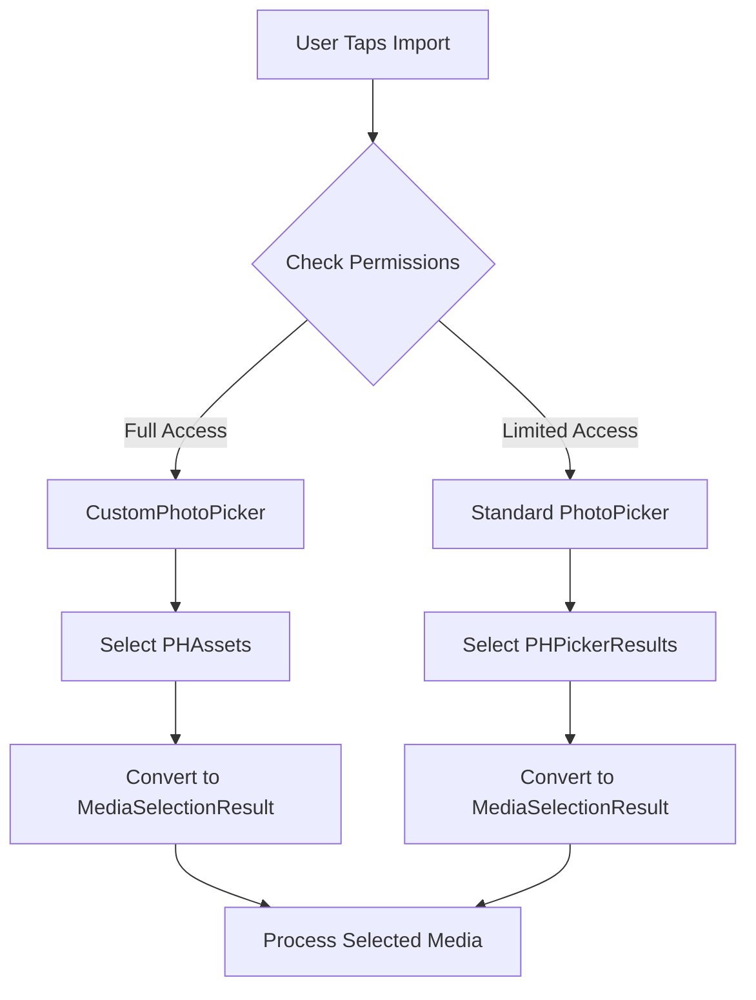

# Photo Picker Architecture in Encamera

## Overview

Encamera provides an enhanced photo selection experience through a three-tier photo picker system that automatically adapts based on photo library permissions.

## Architecture Components

### 1. MediaSelectionResult
A unified result type that bridges both custom and standard photo pickers:

```swift
enum MediaSelectionResult {
    case phAsset(PHAsset)         // From CustomPhotoPicker
    case phPickerResult(PHPickerResult)  // From standard PhotoPicker
}
```

This abstraction eliminates the need for unsafe type casting and provides a clean API for handling selections from either picker.

### 2. PhotoPickerWrapper
The main entry point that automatically selects the appropriate picker:
- **Full Access**: Shows `CustomPhotoPicker` with swipe-to-select
- **Limited Access**: Shows standard `PhotoPicker` with upgrade prompt
- **Denied**: Shows permission alert

### 3. CustomPhotoPicker
Enhanced picker with advanced features (requires full photo library access):
- ✨ **Swipe-to-select**: Select multiple photos with a single swipe gesture
- 🔢 **Selection order numbers**: Visual indicators showing selection sequence
- 🎬 **Video duration badges**: Shows video length on thumbnails
- 📱 **Native performance**: Direct PhotoKit integration

### 4. Standard PhotoPicker
System photo picker used for limited access:
- Runs in separate process for privacy
- Limited UI customization
- No swipe selection support

## Implementation Flow



## Usage Example

```swift
PhotoPickerWrapper(selectedItems: { results in
    // results is [MediaSelectionResult]
    viewModel.handleSelectedMediaResults(results)
}, filter: .any(of: [.images, .videos, .livePhotos]))
```

## Key Benefits

1. **No Unsafe Code**: Eliminates the need for `unsafeBitCast`
2. **Unified API**: Single handler method for both picker types
3. **Type Safety**: Compile-time guarantees with enum-based results
4. **Future Proof**: Easy to extend with new picker types

## Permission Handling

The system handles permissions transparently:

1. **First Use**: Requests permission when user taps "Import from Photos"
2. **Limited Access**: Shows one-time upgrade prompt
3. **Full Access**: Enables all enhanced features
4. **Denied**: Provides clear path to Settings

## Technical Details

### Why MediaSelectionResult?

PHPickerResult cannot be directly instantiated, making it impossible to create a unified picker that returns PHPickerResult objects. Our solution:

- Use an enum to wrap both result types
- Provide common accessors (assetIdentifier, createItemProvider)
- Handle type-specific operations internally

### Live Photo Handling

Live photos require special handling:
- PHAssets: Direct access to paired video/photo resources
- PHPickerResults: Handled through NSItemProvider

Both paths are abstracted through MediaSelectionResult's `createItemProvider()` method. 

## Swipe-to-Select Feature

### How It Works

The CustomPhotoPicker implements an intelligent swipe-to-select system that makes selecting dozens of photos effortless:

1. **Gesture Recognition**: Uses `UIPanGestureRecognizer` to track finger movement across the photo grid
2. **Smart Selection Mode**: Automatically determines whether to select or deselect based on the initial cell's state
3. **Visual Feedback**: Selected photos show numbered badges indicating selection order
4. **Conflict Resolution**: Intelligently handles conflicts between swipe selection and scrolling

### User Instructions

#### Selecting Multiple Photos:
1. **Touch any photo** and immediately start swiping - no need to hold
2. **Photos are selected in real-time** as your finger passes over them
3. **Haptic feedback** confirms each selection with a subtle tap
4. Photos show numbered badges (1, 2, 3...) in selection order
5. Release to finish the selection batch

#### Deselecting Photos:
1. Start swiping from an already selected photo
2. All photos you swipe over will be deselected
3. Selection numbers automatically update

#### Tips for Efficient Selection:
- **Horizontal swipes** work best for selecting rows of photos
- **Diagonal swipes** let you select across multiple rows
- **Slow swipes** (< 200 pts/sec) prioritize selection over scrolling
- **Fast swipes** will scroll the view instead of selecting

### Technical Implementation

```swift
// Enhanced swipe selection with real-time feedback
private let feedbackGenerator = UIImpactFeedbackGenerator(style: .light)

@objc private func handlePanGesture(_ gesture: UIPanGestureRecognizer) {
    switch gesture.state {
    case .began:
        // Disable scrolling to prevent conflicts
        collectionView.isScrollEnabled = false
        feedbackGenerator.prepare()
        
    case .changed:
        // Interpolate points along gesture path for smooth selection
        let points = interpolatePoints(from: startPoint, to: location, count: 10)
        for point in points {
            if let indexPath = collectionView.indexPathForItem(at: point) {
                processIndexPath(indexPath)
            }
        }
        
    case .ended:
        // Re-enable scrolling
        collectionView.isScrollEnabled = true
    }
}
```

### Performance Optimizations

- **Real-time Selection**: Photos are selected immediately as finger passes over them
- **Path Interpolation**: Ensures no photos are missed during fast swipes
- **Haptic Feedback**: Provides instant tactile confirmation of selections
- **Scroll Locking**: Prevents accidental scrolling during selection gestures
- **Batch Processing**: Each cell is only processed once per swipe
- **Memory Efficient**: Uses `OrderedSet` for O(1) lookups with preserved order

### Limitations

The swipe-to-select feature requires **full photo library access** because:
- It needs direct access to `PHAsset` objects
- The system PhotoPicker runs in a separate process
- Apple's privacy restrictions prevent gesture forwarding between processes

Users with limited photo access will see the standard system picker with a prompt to upgrade permissions. 